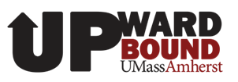
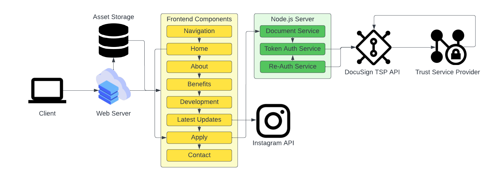

# Upward Bound



## **Overview**

### **Link**

*Coming soon*

### **Description**

Upward Bound is a program that provides academic and cultural enrichment opportunities for high school students from low-income families and/or first-generation college students. The program is designed to help students prepare for college and to succeed in their postsecondary education.

### **Developers**

A special thanks to the developers for their work on this project. This project would not be possible without their contributions.

<a href="https://github.com/build-umass/upward-bound/graphs/contributors">
  
</a>

Made with [contrib.rocks](https://contrib.rocks).

## **Table of Contents**
  - [Overview](#overview)
    - [Link](#link)
    - [Description](#description)
    - [Developers](#developers)
  - [Table of Contents](#table-of-contents)
  - [Getting Started](#getting-started)
    - [Installation and Setup](#installation-and-setup)
    - [Step 1: Prerequisites](#step-1-prerequisites)
    - [Step 2: Clone the Repository](#step-2-clone-the-repository)
    - [Step 3: Install Dependencies](#step-3-install-dependencies)
    - [Step 4: Run the Application](#step-4-run-the-application)
    - [Step 5: View the Application](#step-5-view-the-application)
  - [System Architecture](#system-architecture)
    - [Diagram](#diagram)

## **Getting Started**

*Note: This is a work in progress. The following instructions are not yet complete and are subject to change as project development progresses.*

These instructions will get a copy of the project up and running on a local machine for development and testing purposes only. 

### **Installation and Setup**

You will need the following software installed on your machine prior to running the project. The links below will take you to the installation pages for each software.

### **Step 1: Prerequisites**

- [Node](https://nodejs.org/en/)
- [NPM](https://www.npmjs.com/)
- [VSCode](https://code.visualstudio.com/)
    - Install the appropriate language support for each language used in the project, e.g. [Python](https://marketplace.visualstudio.com/items?itemName=ms-python.python), [JavaScript](https://marketplace.visualstudio.com/items?itemName=ms-vscode.javascript), etc.
- [React.js](https://reactjs.org/)
- [Git](https://git-scm.com/)

### **Step 2: Clone the Repository**

- Navigate to the desired project directory on your computer.

    ```bash
    $ cd <path>
    ```

- Clone the repository from [GitHub](https://github.com/build-umass/upward-bound.git) using the `git clone` command.

    ```bash
    $ git clone https://github.com/build-umass/upward-bound.git
    ```

- Navigate to the cloned repository directory.

    ```bash
    $ cd upward-bound
    ```

### **Step 3: Install Dependencies**

- Install the dependencies using the `npm install` command.

    ```bash
    $ npm install
    ```
### **Step 4: Run the Application**

- Run the application using the `npm start` command.

    ```bash
    $ npm start
    ```
### **Step 5: View the Application**
- The command from Step 4 will locally host the website on `http://localhost:3000`.

## **System Architecture**

### **Diagram**

The following diagram shows the system architecture for the Upward Bound project. The diagram is a work in progress and is subject to change as project development progresses.


